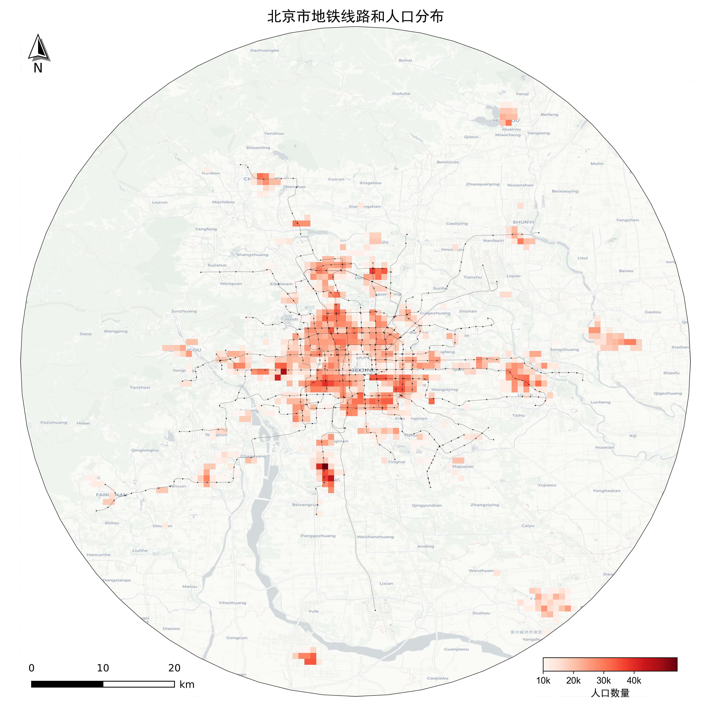

## 数据源

- 地铁：
    - 2025年
    - 高德
    - [CPTOND-2025](https://figshare.com/articles/dataset/CPTOND-2025/29377427)
- 人口
    - 2020年
    - [A 100-m gridded population dataset of China’s seventh census using ensemble learning and geospatial big data](https://figshare.com/s/d9dd5f9bb1a7f4fd3734?file=43847643)

## 可视化

